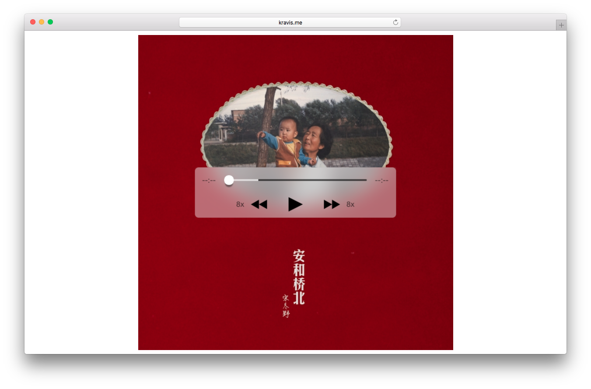

# music_player-1.1
[This is demo](http://www.kravis.me/demo5)

### Version 1 基本的音乐播放器界面
- [x] #### Mar 15, 2016 Version 1.1

      完成播放器 CSS 布局。

      *未完成 iOS 端的适配，计划在 Version 2.0 实现；OS X 中仅有 Safari 9.0 以上版本支持 `-webkit-backdrop-fliter` 属性，遂其它浏览器不能正常显示背景模糊效果，将在 Version 1.3 中加入 JS 以显示相关提示。*

- [x] #### Mar 17, 2016 Version 1.2

      完成实现播放器的基本功能（播放，暂停，快进，快退，进度条拖动，时间显示）。

      - [x] 播放 / 暂停；
      - [x] 快进 / 快退；
      - [x] 进度条显示；
      - [x] 进度条拖动；
      - [x] 时间显示。

- [x] #### Mar 19, 2016 Version 1.3

      完成尽量多的平台的各个浏览器（尤其是 iOS, OS X 下的浏览器）的适配、各项优化。

      - [x] Safari 9.0 + 检测，若不是，则使 `music-player-controller` 的不透明度增强；
      - [x] 修复 preload 的相关问题；
      - [x] 优化滑动 slide bar 时的网络请求；
      - [x] 加入滑动时时间颜色的动画。
      

- [ ] #### Mar 21, 2016 Version 1.4
      
      只在需要的地方显示 `div.tip`，并优化其显示效果，JavaScript 与 HTML 分离。

      - [x] 完善 `disableScroll`；
      - [x] 优化 tip 在 Mobile 端的显示；
      - [x] 加入 audio 的载入动画；
      - [ ] Andriod 下 audio 载入异常。

### 待优化
- [x] 在 iOS 的 Safari 中 `:hover` 伪类的不合理使用；
- [x] 没有除去 iOS 的 highlight 显示；[Remove Gray Highlight When Tapping Links in Mobile Safari](https://css-tricks.com/snippets/css/remove-gray-highlight-when-tapping-links-in-mobile-safari/)
- [x] 未使用雪碧图加载所有 icons；
      使用 sprite icons 后的按钮动画效果会出现错误，因此暂时除去动画，将在后续版本中加入。`<input>`等替代元素（[Replaced Elements](http://reference.sitepoint.com/css/replacedelements)）不能使用 `::before` 等伪元素，因而不能直接实现动画（[Fade Image Into Another (within a Sprite)](https://css-tricks.com/fade-image-within-sprite/)）。
- [x] iOS 在控制中心暂停后图标不变；
- [x] Chrome 不能快退，速度范围 0 - 4，背景无滤镜；
- [x] Firefox 的 slide bar 拖动后不恢复播放状态；
- [x] slide bar 滑动效果；
- [x] iOS 9.2.1 下的 `<input>` 出现异常白色线条；
      在 `<head>` 下加入 `<meta name="viewport" content="width=device-width, initial-scale=1, maximum-scale=1">` 后暂时结局，具体原因未知。
- [x] iOS 在控制中心名称。
      [Audio and Video HTML](https://developer.apple.com/library/safari/documentation/AudioVideo/Conceptual/Using_HTML5_Audio_Video/AudioandVideoTagBasics/AudioandVideoTagBasics.html)，在 `<audio>` 下加入属性 `title`。

### 放弃
- [ ] iOS 下的点击 slide bar 即修改 value；
      放弃原因：不符合标准操作。
- [ ] Android 下的 `:hover`, `:active` 等伪类未适配。
      放弃原因：无 Andriod 设备可供测试。